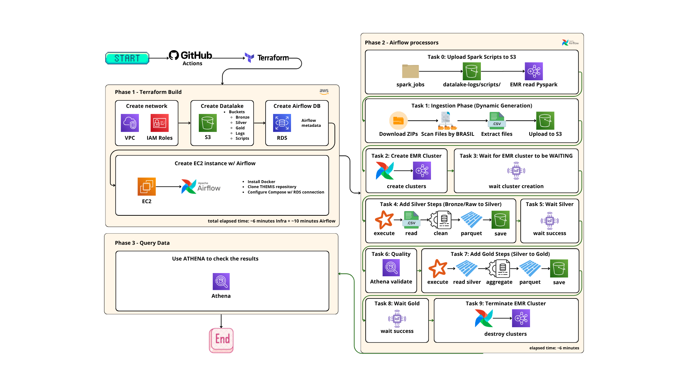

# Project THEMIS ⚖️


*High-level architecture of Project THEMIS data pipelines and infrastructure.*

A Production-Grade Big Data platform for ingesting, processing, and analyzing Brazilian public political data. 

**🎯 Business Objective (Electoral ROI):** The core objective of Project THEMIS is to correlate declared assets, campaign expenditures, and received votes to calculate the **Cost per Vote** and the Return on Investment (ROI) of every political candidate in Brazil, consolidating billions of records into a single analytical *Wide Table* (Gold Layer).

---

## 🛠️ Tooling & Architecture Choices

A robust data platform is built not just on tools, but on the right tools for specific problems. Here is the reasoning behind the technology stack:

### 1. Infrastructure as Code: Terraform
Instead of manually clicking through the AWS Console (ClickOps), **Terraform** was chosen to guarantee reproducibility. Every resource (VPC, S3, IAM Roles, EMR settings) is codified. This allows the entire infrastructure to be spun up or destroyed in minutes via CI/CD, eliminating configuration drift and manual errors.

### 2. Orchestration: Apache Airflow (Dockerized on EC2)
**Airflow** is the industry standard for scheduling and orchestrating data pipelines. It was chosen over AWS Step Functions because of its dynamic, Python-based DAG generation and its vast ecosystem of providers. By containerizing Airflow on a lightweight EC2 instance, we maintain full control over the environment while keeping orchestration decoupled from heavy processing.

### 3. Data Lake Storage: Amazon S3 (Medallion Architecture)
**Amazon S3** provides highly durable, inexpensive object storage. The data lake is logically separated into the **Medallion Architecture**:
* **Bronze:** Raw data as ingested from the source (mostly CSVs extracted from ZIPs).
* **Silver:** Cleansed data, schema-enforced, and converted to columnar `Parquet` format with Snappy compression for query optimization.
* **Gold:** Business-level aggregated data (Wide Tables) ready for analytical consumption.

### 4. Distributed Compute: Apache Spark on Amazon EMR
Given the volume of data (millions of rows of electoral expenses and votes), single-node processing (e.g., Pandas) would result in Out-Of-Memory (OOM) errors. **Apache Spark** allows distributed, in-memory processing. We chose **Amazon EMR** to run Spark because it provides managed transient clusters that Airflow can spin up, submit jobs to, and terminate, meaning we only pay for compute exactly when data is being processed.

### 5. Data Discovery & Analytics: AWS Glue & Amazon Athena
To allow end-users to query the data instantly without writing DDL statements, an **AWS Glue Crawler** automatically sweeps the Gold bucket, infers the schema, and populates the Glue Data Catalog. **Amazon Athena** is then used as a serverless query engine to run standard SQL directly on top of the S3 Parquet files.

---

## 🏗️ Architectural Trade-offs

As a project aimed at demonstrating production readiness, several architectural trade-offs were consciously made:

1. **Local Ingestion vs. Direct S3 Streaming:** The `.zip` file format holds its central directory (index) at the end of the file. Therefore, it is technically unfeasible to extract specific files (*_BRASIL.csv*) via direct streaming from the internet to S3. We opted to use the EC2 instance's disk for downloading and sequential extraction, ensuring stability against connection drops from the TSE servers.
2. **FinOps & EMR Spot Instances:** Purely *On-Demand* EMR clusters generate high idle costs. To reduce processing costs by up to 90%, our DAG configures the EMR Master Node as *On-Demand* (ensuring job stability) and the Processing Nodes (Core) using **SPOT** market pricing.
3. **Security (Hardening):** Given this is an ephemeral infrastructure destroyed via CI/CD, RDS (PostgreSQL) and AWS access keys are injected via **GitHub Secrets** during deployment. In a persistent corporate environment, these credentials would strictly reside in **AWS Secrets Manager** or HashiCorp Vault.
4. **Data Quality Strategy (PySpark vs. dbt):** Since we are generating the datasets from scratch (In-Memory Processing), we enforce data quality tests (null removal, logical asserts, volume thresholds) natively in PySpark *before* writing to S3. This guarantees that corrupted data never enters the Data Lake (Fail-Fast), which is a preferable approach over using dbt for the Silver layer (which validates data post-write).

---

## ⚙️ Step-by-Step Pipeline Execution

When the pipeline is triggered, the following sequential process occurs autonomously:

1. **Infrastructure Deployment:** GitHub Actions runs `terraform apply`, provisioning the network, S3 buckets, IAM roles, RDS database, and the Airflow EC2 instance.
2. **Data Ingestion:** Airflow triggers Python scripts that download heavy `.zip` files from the TSE portal. The scripts extract only the national consolidated files (`*_BRASIL.csv`) and upload them to the **Bronze** S3 bucket.
3. **Transient EMR Provisioning:** Airflow dynamically provisions an Amazon EMR cluster (Spark).
4. **Bronze to Silver (Data Quality):** Airflow submits a PySpark job to EMR. Spark reads the raw CSVs, normalizes column names, casts numeric types, and runs **Data Quality checks**. If a dataset is empty or lacks primary keys, the job fails fast. If it passes, data is saved as compressed Parquet in the **Silver** bucket.
5. **Silver to Gold (Business Logic):** A second PySpark job reads the Silver datasets, using the `candidatos` dimension as the spine to left-join total assets, total expenses, and total votes. The job calculates the Electoral ROI (`custo_por_voto`) and writes the Wide Table to the **Gold** bucket, partitioned by State and Political Office.
6. **Cost Optimization (Cluster Termination):** Regardless of success or failure, Airflow triggers the immediate termination of the EMR cluster to halt billing.
7. **Automated Data Discovery:** Airflow triggers the AWS Glue Crawler, which updates the Athena catalog partitions. The data is instantly available for SQL querying.

---

## 📁 Project Structure

```text
├── .github/workflows/         # CI/CD pipelines (Terraform Deploy/Destroy)
├── airflow/dags/              # Orchestration pipeline (themis_dag.py)
├── pipelines/                 # Data ingestion scripts
├── spark_jobs/                # PySpark transformations (Bronze->Silver->Gold)
├── terraform/                 # Infrastructure as Code (AWS resources)
└── README.md
```

---

## 🚀 How to Run the Project

### Prerequisites
1. **S3 Backend**: Create an S3 Bucket in your AWS account to store the `terraform.tfstate`. Update `terraform/providers.tf` with your bucket name.
2. **GitHub Secrets**: Create the following Repository Secrets:
   - `AWS_ACCESS_KEY_ID` and `AWS_SECRET_ACCESS_KEY`
   - `DB_PASSWORD`: Password for the Airflow RDS database.

### Deploy and Destroy
- **Deploy**: A push to `main` modifying `/terraform` triggers the deployment via GitHub Actions.
- **Run Pipeline**: Find the EC2 instance named `themis-dev-airflow` in AWS. Access Airflow at `http://<EC2-PUBLIC-IP>:8080` and trigger the `themis_orchestration_pipeline` DAG.
- **Destroy**: Manually trigger the `Terraform Destroy` workflow in the Actions tab to wipe out the environment and prevent billing.

---

## 📊 Querying Data (Amazon Athena)

Thanks to the automated **AWS Glue Crawler** triggered by Airflow at the end of the pipeline, the data catalog is automatically populated. You do not need to configure any DDL or crawlers manually. 

To query the data, simply open **Amazon Athena** in your AWS Console:

```sql
-- Analyzing Candidates' Cost per Vote
SELECT 
  nm_candidato, 
  sg_uf,
  ds_cargo,
  qt_votos, 
  total_vr_despesa, 
  custo_por_voto
FROM "themis_gold_db"."campaign_analytics"
ORDER BY custo_por_voto ASC
LIMIT 10;
```

---

## 📸 Project Showcase

*(Images placeholder: Run the pipeline and add the screenshots to `docs/assets/`)*
1. **Infrastructure Deployment (GitHub Actions)**
2. **Orchestration (Apache Airflow)**
3. **AWS Resources (EMR/EC2)**
4. **Data Lake Structure (Amazon S3)**
5. **Final Analytics (Amazon Athena)**
